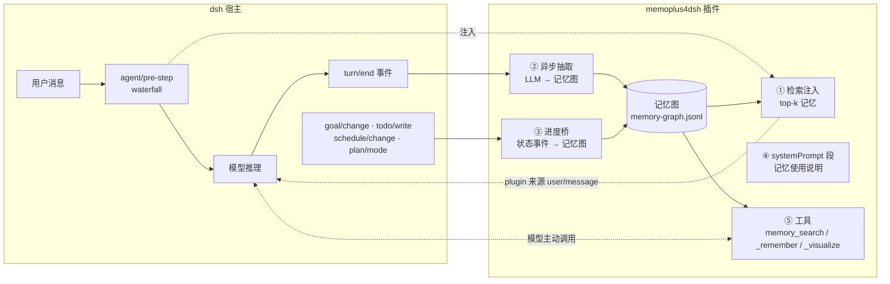
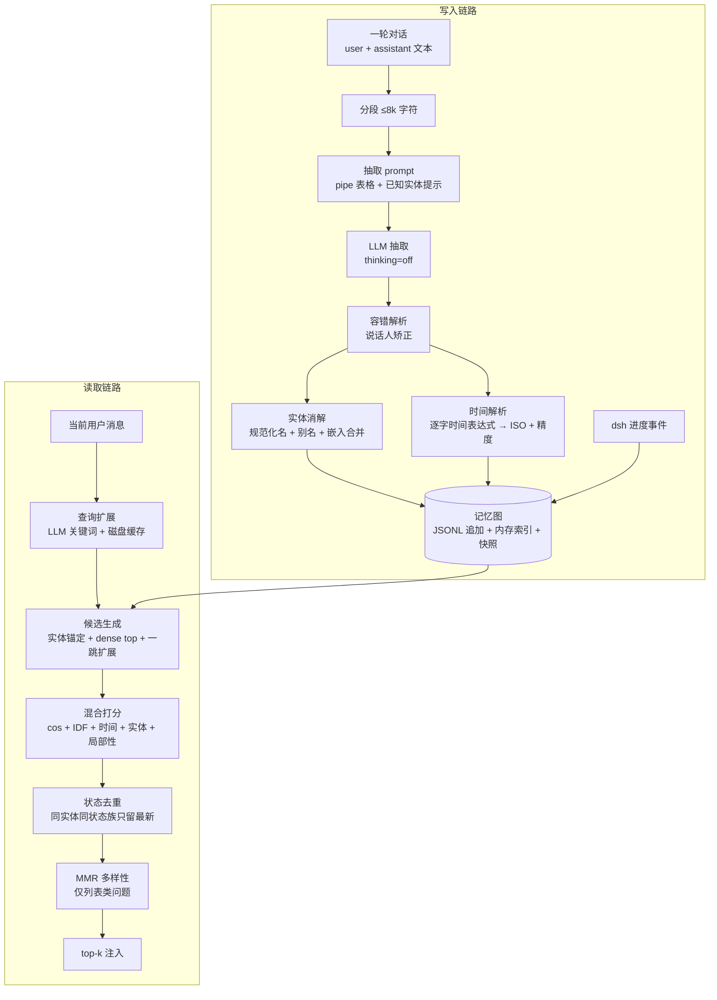

# memoplus4dsh Technical Report

> 中文：[tech-report.md](tech-report.md)

**A unified entity–time-fused memory plugin for deepseek-harness**

> Version: v0.2 · Date: 2026-09-05
> Code & reproduction: this repository (README.md · docs/ · benchmark/)

## Abstract

The "memory" of LLM agents has broadly degenerated into date-stamped markdown fragment files — unsearchable, unable to evolve, and reset to zero across sessions. We implemented **memoplus4dsh** for deepseek-harness (dsh): a memory system mounted as an official plugin that stores facts, preferences, schedules, and task progress uniformly in **a single entity–time-fused memory graph**. This report fully describes its mechanisms: the formal model of the memory graph (§3), LLM-based incremental extraction and entity resolution (§4), hybrid retrieval and state deduplication (§5), the plugin engineering form (§6), and a reproducible evaluation on MemoryAgentBench (§7). Key results: on the official benchmark (1031 questions, official code and metrics, full-session tool-whitelist auditing), we achieve **Conflicting Facts · multi-hop 30.25** (all public baselines ≤7.0, 4.3× the best baseline), **Conflicting Facts · single-hop 57.75** (first among memory systems, second only to GPT-4o with the full text stuffed into the context window), and **Accurate Retrieval LME(S*) 56.67** (first overall).

## 1. Background and Motivation

### 1.1 Three failure modes agent memory must solve

Observing memory practices in current agent projects, failures concentrate in three categories:

- **Fragmentation.** Most homegrown agents generate one `memory/YYYY-MM-DD.md` per day. No structure, no temporal semantics, no cross-file entity identity; when a fact is updated, old and new values coexist and fight in two files; a new session resets everything to zero.
- **Conflicting updates (selective forgetting).** Retrieval-based memory stores (chunk vectorization + top-k recall) fail collectively in "fact was updated" scenarios: the user first says "I live in Beijing", then two months later says "I moved to Shanghai"; retrieval recalls both, and the model picks one at random. The systematic evaluation in the MemoryAgentBench paper (arXiv:2507.05257) shows that on this task (Conflicting Facts), in the multi-hop setting all baselines score ≤7%, and even the reasoning model o4-mini collapses from 80.0 to 14.0 after 32k context. **This is the hardest open problem in the entire memory-system field.**
- **Progress loss.** The agent framework's own task state (goals, todos, schedules) is usually a per-session event log — a new session knows nothing about "how far did that task get" from an old one. Memory systems generally only manage conversational facts, not the agent's own progress state.

### 1.2 Design goals

Give the agent a **unified, complete, evolvable** long-term memory:

1. One graph holds all memory — conversational facts, user preferences, schedules, and task progress stored isomorphically and retrieved uniformly;
2. Time is a **first-class structural dimension**, not a string annotation — a fact's "time of occurrence" and "time of mention" are modeled separately;
3. Old values **yield but are not deleted** — retrieval prefers the latest state, while full history is auditable and can answer "when was it changed";
4. Engineering-wise, it is a **first-class citizen plugin** of the host framework: install/uninstall fully reversible, zero lines of host code changed, works on all platforms, no new API keys.

The technical foundation comes from the predecessor memoplus/ETMS (Entity–Time-fused Memory System), which validated the core mechanisms on the LoCoMo benchmark (82.9% under the mem0 standard protocol, 81.4% on the temporal category). This project reimplements the core mechanisms in TypeScript and ports them into the dsh plugin system, with architecture-level reinforcement targeting "task progress must not be lost" (§4.4, §5.4).

## 2. System Overview

### 2.1 Plugin mount points: where memory takes effect

dsh's architecture is "everything-is-a-plugin" (the Cordis framework). A plugin is an npm package that exports `name` / `inject` / `apply(ctx, config)`; all registration goes through `ctx.effect()` (the framework automatically rolls back in reverse order on uninstall). memoplus4dsh takes effect through five official mount points, **without patching dsh in any way**:



| Mount point | dsh mechanism | Function |
|---|---|---|
| ① `agent/pre-step` | waterfall decision chain | On the first step of each turn, retrieves top-k memories against the current user message and injects them as a user/message with `source: {kind:'plugin'}` (satisfying dsh's hard constraint "model-visible ⟺ persisted to log") |
| ② `session/event` → `turn/end` | event bus | After a conversation turn ends, asynchronously extracts facts into the graph (does not block the conversation) |
| ③ `session/event` → `goal/change` etc. | event bus | dsh's internal progress events are projected directly into memory events |
| ④ `ctx.systemPrompt.section()` | system prompt assembly | A fixed section of memory usage instructions (no volatile content, does not break the prompt cache) |
| ⑤ `ctx.tools.register()` | tool registry | Model-initiated recall (`memory_search`), explicit memorization (`memory_remember`), and visualization (`memory_visualize`) |

Installation writes the plugin package into the profile's `cordis.patch.yml` (the official patch mechanism, marker-block managed, idempotent); uninstallation performs the exact reverse — reversibility is guaranteed by framework semantics.

### 2.2 The complete data flow



The write path is **incremental, asynchronous, and crash-recoverable**; the read path sits on the conversation critical path, and its latency budget constrains every step (§5).

## 3. Memory Model: Entity–Event Graph and Dual Time Anchors

### 3.1 Formal definition

The memory graph $G = (E, V)$:

**Entities** $e \in E$ (nodes of the graph):
$$e = (\text{id},\ \text{name},\ \tau,\ A,\ \mathbf{v})$$
- $\tau \in \{\text{PERSON}, \text{OBJECT}, \text{CONCEPT}\}$ — **deliberately closed to three types**. We experimented with finer ontologies (place/organization/activity/…) and concluded that over-classification makes the extraction model spend its effort "agonizing over types" rather than "extracting all facts", and downstream retrieval does not consume type information anyway (types are used in only two places: speakers are forced to PERSON, and embedding merge is restricted to the same type).
- $A$ is the alias set ("Snowball" and "my cat" point to the same node).
- $\mathbf{v} \in \mathbb{R}^{512}$ is the embedding vector of the entity name, used only for approximate duplicate-name merging (§4.3).

**Events** $v \in V$ (fact edges of the graph, the basic unit of retrieval and injection):
$$v = (S,\ O,\ p,\ f,\ d,\ x,\ t_e,\ \rho,\ t_m,\ s)$$

| Field | Meaning |
|---|---|
| $S, O \subseteq E$ | subject/object entity sets (object may be empty) |
| $p$ | predicate (short verb/relation, free text) |
| $f$ | normalized fact: **one self-contained sentence** (readable out of context, coreference resolved) |
| $d$ | details (context fragments that don't fit in the main sentence) |
| $x$ | time expression, **copied verbatim from the source text** ("last Saturday", "上周三") |
| $t_e$ | **event_time**: when the thing happened (ISO 8601, nullable) |
| $\rho$ | precision of $t_e$: year / month / week / day / hour / minute / second / unknown |
| $t_m$ | **mention_time**: when the fact was mentioned in conversation (= end of the containing turn, always non-empty) |
| $s$ | source reference (session id + turn number), traceable back to the original conversation |

A real event looks like this (one line in the JSONL log):

```json
{"v":1,"op":"event.add","data":{
  "subjectEntityIds":["…user…"], "objectEntityIds":["…shanghai…"],
  "predicate":"moved_to",
  "normalizedText":"The user moved to Shanghai.",
  "timeExpr":"last month", "eventTime":"2026-08-05T00:00:00.000Z",
  "eventTimePrecision":"month", "mentionTime":"2026-09-05T10:23:41.000Z",
  "sourceSession":"c7f3…", "sourceTurn":12}}
```

### 3.2 Dual time anchors: time is not a vector

**Time in this system is not an embedding vector, but a structured first-class field.** Vectors compress time into similarity, which cannot answer the two essential temporal queries — "range" and "before/after"; we explicitly store two time points:

- $t_e$ (event time): when the thing **happened**;
- $t_m$ (mention time): when the thing **was mentioned**.

The value of separating them is clearest in one example: in October the user says "that interview I had in September was really frustrating". The event has $t_e$=September, $t_m$=October. The query "what happened in September" hits $t_e$; "what did we talk about in October" hits $t_m$; "recent setbacks" involves both anchors in ranking. A single timestamp (the created_at of most systems) can only answer one of these questions.

For a comparison with Zep/Graphiti's bi-temporal model (valid_at/invalid_at + created_at), see §8 — in short, they model "the validity period of a fact", we model "occurrence vs mention", and we **do not mark edges as invalidated**: history is always fully preserved (§5.4).

## 4. Write Path: Incremental Extraction, Entity Resolution, and the Progress Bridge

### 4.1 Extraction input construction: what gets in, what doesn't

Each conversation turn end (`turn/end` with reason=completed) triggers one asynchronous extraction. Input construction (`buildTurnText`) rebuilds the turn's text from the session log and **accepts only four kinds of messages**:

- `User:` real user input;
- `Goal:` goal-mode turn prompts (carrying the goal and turn number, the core context for long-horizon task progress);
- `Schedule:` reminders dispatched by the schedule plugin;
- `Assistant:` model replies.

**Explicitly excluded**: runtime context snapshots, workspace instructions, and this plugin's own memory injections — feeding the latter back into extraction would cause "memory self-replication" (a memory being recorded again as a new fact).

Two-level protection against overlong input: a 20k-character total truncation (keep head and tail, cut the middle); then **8k-character segmentation** with independent extraction followed by merging — the segment size comes from measurement: reasoning models on dense extraction inputs ≥17k characters will reason indefinitely with empty visible output (see F-1 in Appendix C); 8k is a verified-safe size.

### 4.2 LLM extraction: the pipe-table protocol

Extraction is a single LLM call whose output protocol is a pipe-delimited nine-column table:

```
ENTITY_TYPE|CANONICAL_NAME|ALIASES|PREDICATE|OBJECT|TIME_EXPR|NORMALIZED_FACT|DETAILS|KIND
PERSON|Alice|_|is_from|hometown|_|Alice is from her hometown.|_|fact
PERSON|Bob|Bobby|painted|landscape|last year|Bob painted a landscape last year.|_|fact
PERSON|Alice|_|asked|weekend plans|_|Alice asked about the weekend plans.|_|speech
```

The `KIND` column (added in M11) lets the extraction model itself decide whether the row is a fact or a speech act (`fact`/`speech`) — **semantic judgment, not vocabulary matching, valid for any language**. Speech-act events are tagged `speechAct` at write time and down-weighted on the retrieval side by the tag (§5.2) — not deleted, and still reachable by explicit search.

We chose LLM extraction (rather than regex/NER/embedding clustering) because the hardest part of memory was never entity recognition, but **coreference resolution and self-containment**. Key rules distilled into the prompt (each verified by LoCoMo experiments in the predecessor project):

- **Pronoun/anaphora resolution**: "we did it", "that cup" must be expanded into concrete people and things — every fact is readable out of session context;
- **The speaker is an entity**: when the speaker states/asks/comments on a topic, the subject is the speaker and the predicate expresses the speech act (said/asked/praised);
- **Lists go row by row**: "likes A, B, C" splits into three rows;
- **Static attributes use `is`**: eternally-true attributes like "where someone is from" or "marital status" are distinguished from dynamic events;
- **Do not extract instructions or meta-narration** (added in M11): task instructions/rule sentences like "answer only from the knowledge pool" are not facts; once in the graph they overlap verbatim with every question at retrieval time and dominate top-k (evaluation attribution RC2);
- **TIME_EXPR is copied verbatim; the model is forbidden from doing date arithmetic** — this is a key design: LLM date arithmetic is unreliable, while the reference point for "last Saturday" is determinate. The model only copies the source time expression **as-is**; conversion to absolute time is done by deterministic code (§4.5);
- **Known-entity hints**: the prompt carries existing entity names relevant to the current text (filtered by whether the name appears in the text, hard cap 4000 characters), guiding the model to reuse canonical names instead of inventing new ones — the first line of defense for entity resolution;
- The fact language follows the conversation language.

The parsing layer is **fault-tolerant**: skips empty lines/headers/malformed lines, tolerates the model writing `|` as `<field>`, pads rows with `<7` columns with empty fields, drops facts shorter than 12 characters; speaker names are force-corrected to PERSON type. The extraction call explicitly disables thinking (reasoning on structured tasks is pure waste and triggers the F-1 empty output in Appendix C), with an 8192-token output budget and a 120s timeout.

### 4.3 Entity resolution: the same "Snowball"

The same concept appears under different names across conversations and must be merged into one node, otherwise the graph shatters into islands. Resolution proceeds in order (`createOrResolve`):

1. **Normalized-name exact match (type-agnostic)**: $\text{norm}(n) = \text{lowercase}(\text{collapse-space}(\text{trim}(n)))$, with a hash index over canonical names and all aliases $A\text{Index}: \text{norm}(n) \mapsto e$. **Matching is not filtered by type** — the extraction model's type judgment for the same name flips from turn to turn (PERSON↔CONCEPT), and type filtering once turned 45.8% of the nodes in a real graph into duplicates (MemoryAgentBench run-2 attribution, 2820 groups of duplicate names); the type of the first creator is kept. The homonym risk (same name, different things) is acceptable in personal-agent scenarios, and the extraction prompt's known-entity hints carry existing types (`Alice (PERSON)`), reducing flips at the source;
2. **LLM-adjudicated entity merging** (M11; merging decided by the LLM rather than stacked rules): new mentions that miss the exact-name match (subjects and objects alike) first get **embedding-similarity candidate recall** (multilingual vectors, threshold deliberately loosened to 0.6/top-5 — coarse recall), then one more LLM call adjudicates each candidate: "same entity or not". **Only an explicit `sure` merges** (mini-4 measurement: a bare yes wrongly merges proper nouns that look alike but aren't — "Islam"→"Iman"); the prompt carries types and contextual facts, and explicitly states "different types are strong evidence against merging". When embeddings are unavailable it degrades to containment-relation candidates + LLM adjudication; if the adjudication call fails, no merge. Approximate embedding merging (synchronous embedder tier, cos ≥ 0.9) is kept as the low-budget path when no LLM budget is available:
$$\text{merge}(n, e^*) \iff \cos(\mathbf{v}_n, \mathbf{v}_{e^*}) \ge 0.9,\quad e^* = \arg\max_{e} \cos(\mathbf{v}_n, \mathbf{v}_e)$$
3. Merging is alias accumulation: the new name and the aliases carried this time are merged into $A$, with the index synchronized — any of the names appearing later hits the same node.

**Event-side deduplication** (M11): rows with the same (session, turn, predicate, normalized fact, timeExpr) are written only once — re-extraction after crash recovery is therefore idempotent, and duplicate rows between segments of the same turn no longer stack up. Bridge events (turn=-1) and legitimate repeated mentions in different turns are unaffected.

### 4.4 Progress bridge: the agent's task state enters the same graph

dsh's goal/todo/schedule/plan state is a per-session event log, lost across sessions. The progress bridge (`bridges.ts`) listens to these four kinds of internal events, **reads payloads structurally (duck typing, zero upstream dependencies)**, and projects them into ordinary memory events:

| dsh event | Memory event example | Predicate (state family) |
|---|---|---|
| `goal/change` | "Goal 'finish the evaluation' status updated to running" | `goal_create` / `goal_update` / `goal_complete` / `goal_block` / … |
| `todo/write` | "Todo list updated: 3/5 items done. In progress: writing the report…" (full snapshots deduplicated by content signature) | `todo_snapshot` |
| `schedule/change` | "Created a recurring reminder 'submit weekly report on Friday' (weekly)"; reminder text auto-completed on delete/dispatch | `schedule_create` / `schedule_delete` / `schedule_dispatch` |
| `plan/mode` | "Entered plan mode" | `plan_mode` |

For such events $t_e = t_m$ (the event is recorded as it happens), and the predicate carries a state-family prefix (`goal_` etc.), which is the marker for state deduplication in §5.4. At this point, **conversational facts and the agent's own task progress live in the same graph and go through the same retrieval path** — "how far did that task get last time" and "where do I live" are isomorphic questions to the system. To our knowledge, no existing public memory system (Mem0/Zep/A-MEM/HippoRAG, etc.) covers the agent's own progress state; this coverage is unique to this work.

### 4.5 Time resolution: deterministic conversion + precision

`resolveTimeExpr(x, t_m)` converts a verbatim time expression into absolute time, outputting $(t_e, \rho)$. It covers general Chinese and English temporal constructs: ISO dates, "last/next/this + week/month/year/星期X", "N days/weeks/months ago", "the week before 9 June 2023", seasons, "昨天/上周三/三个月前/去年", etc. **Only language-level general constructs are included — no dataset vocabulary** — to prevent benchmark overfitting.

The precision $\rho$ matches the granularity of the expression: "last year" has year precision, "上周三" has day precision. Precision is used for range matching on the query side (§5.3), avoiding mistaking "last year" for a specific date.

### 4.6 Persistence and crash recovery

Storage is an **append-only JSONL log + in-memory index** (`store.ts`):

- Each record is an operation envelope (`entity.upsert` / `entity.delete` / `event.add` / `event.delete`), appended atomically with a single-line `write(2)`;
- Memory holds the entity table, event table, alias index, and entity→event inverted index;
- A snapshot compaction (tmp + rename full rewrite) runs every 1000 operations; corrupt lines (half-lines from crashes) are skipped line by line and counted;
- Why JSONL instead of SQLite: zero-compilation cross-platform, human-readable, diffable, consistent with dsh's own session-log style; at personal-agent memory scale (thousands to tens of thousands of events) brute-force retrieval is millisecond-level, so no index structures are needed.

The extraction queue is **serial, bounded-retry, crash-recoverable**: one LLM call at a time (avoiding burst rate limiting), failures retried twice with 5s/30s backoff then skipped and logged; a persisted pending log (one line on enqueue, a tombstone on settle) lets unsettled tasks be re-extracted automatically after a process crash and restart — the worst-case cost of a crash is one duplicate extraction (a few extra duplicate event lines), and a turn is never lost.

## 5. Read Path: Hybrid Retrieval, Temporal Operators, and State Deduplication

Retrieval happens on the conversation critical path (the first step of `agent/pre-step`, and `memory_search` tool calls). Input is the current user message; output is top-k (default 8) events. Four steps.

### 5.1 Candidate generation

The union of three sources:

1. **Entity anchoring**: known entity names/aliases appearing verbatim in the query text → all events of those entities ($|\cdot|$ is usually small);
2. **Dense top slice**: the top $2k$ events of the whole graph by $\cos(\mathbf{v}_q, \mathbf{v}_v)$ (degrading to an IDF word-overlap slice when embeddings are unavailable — **functional degradation, not unavailability**);
3. **One-hop graph expansion**: take all entities involved in the top 15 events of the dense slice, and merge their adjacent events (at most 200 per entity) into the candidate pool.

One-hop expansion is the key to multi-hop questions: the query only mentions entity A, but the answer needs "things about B related to A" — the shared entity pulls B's events into the candidate pool, and scoring decides their fate.

### 5.2 Hybrid scoring

An event's score is the weighted sum of six content signals, multiplied by a noise discount (weights ported from the predecessor project and validated; the speech-act discount was added in M11):

$$\text{score}(v) = \delta_{\text{speech}}(p_v)\cdot\Big[\underbrace{\cos(\mathbf{v}_q, \mathbf{v}_v)}_{\text{dense}} +\ 2\cdot\underbrace{\frac{\sum_{w \in q^\*} \text{idf}(w)\cdot [w \in W_v]}{\sum_{w \in q^+} \text{idf}(w)}}_{\text{IDF 归一化词重叠}} +\ \underbrace{\min\!\big(0.25\!\!\sum_{w \in q^+\setminus q^*}\!\!\text{idf}(w)\,[w \in W_v],\ 2\big)}_{\text{扩展词奖励}} +\ \underbrace{0.5\!\!\sum_{d \in D}\!\text{idf}(d)\,[d \in W_v]}_{\text{关键描述词}} +\ \underbrace{0.5\cdot[V(v) \cap E_q \ne \emptyset]}_{\text{实体奖励}} +\ \underbrace{b_T(v, \text{op})}_{\text{时间奖励}}\Big]$$

where $\delta_{\text{speech}}(v) = 0.3$ when event $v$ carries the `speechAct` tag (semantically judged by the extraction model at write time, see §4.2 — **not** retrieval-side vocabulary matching, valid for any language), and 1 otherwise. Speech-act events ("User asked …") overlap verbatim with later questions and would dominate top-k without the discount (evaluation attribution RC2: Q&A noise once pushed gold events out of top-12); the discount only down-weights, never deletes, and explicit search can still hit them. Events from older graphs lack the tag and are automatically treated at full score (backward compatible).

Where:

- $\text{idf}(w) = \ln\frac{N+1}{\text{df}(w)+1} + 1$, with $N$ the number of events in the candidate pool — IDF is computed dynamically **within the candidate pool**, approximating global IDF as the graph grows;
- $q^*$ is the query stem set (lightweight stemming: ies→y, stripping ing/ed/es/s/e suffixes), $q^+ = q^* \cup$ LLM expansion terms;
- **Keyword-side tokenization**: ASCII words + **CJK bigrams** (spaceless languages like Chinese participate in matching as character bigrams; whole segments and single characters also enter the set, ensuring graded overlap);
- $D$ is the key descriptor set: content stems after stripping question scaffolding (what/how/kind of) and generic light verbs (make/take/like/…) — in "what kind of **pottery** does she like", pottery gets an extra reward;
- **LLM query expansion** (≤12 keywords/phrases, including typo correction and synonyms) results are **disk-cached** by normalized query text — the same question is expanded only once, with a 30s timeout on the pre-step critical path and degradation to no expansion on failure;
- An event's matching text = entity names + predicate + normalized fact + details.

After ranking, a **conversational locality bonus**: take the top-5 anchor events; events in the same turn/adjacent turns (±1/±2 turn, asymmetric fore and aft) as an anchor, or sharing an object entity with it, receive a bounded bonus (per-term caps, scaled by the anchor's own score) — simulating "when something is being discussed, the things around it are also relevant". Final ordering uses a three-level tie-break of (score bucket, query coverage, hit IDF quality).

**List-type questions** (detected via generic plural/aggregate phrasing such as "what kinds of…", "all the…") additionally get **MMR diversity re-ranking**:
$$\arg\max_{v \in R}\ \big[\text{score}(v) - \lambda \max_{s \in S} \cos(\mathbf{v}_v, \mathbf{v}_s)\big],\quad \lambda = 3.0$$
to prevent near-duplicate entries from occupying top-k seats.

### 5.3 Temporal operators: hard filtering + soft weighting

The query is first parsed into a temporal operator (`resolveTemporalQuery`):

| Operator | Trigger example | Behavior |
|---|---|---|
| `DENSE` | no temporal intent | no filtering; only a tiny mention-recency bonus $0.3/(1+d_m/30)$ |
| `LAST_K` | "the most recent time", "the last time" | no hard filter; decay bonus by event time (mention time if missing) $0.25/(1+d/14)$ |
| `WITHIN_WINDOW` | "recently" (180 days), "in the past 3 weeks", "昨天" | **hard filter**: events outside the window are out |
| `IN_YEAR` / `IN_MONTH` / `IN_SEASON` | "last year", "in June 2025", "during the summer", "去年" | hard filter: outside the calendar interval is out |

The **dual-anchor matching** rule for hard filters:
$$\text{match}(v, \text{range}) \iff t_e \in \text{range}\ \lor\ t_m \in \text{range}$$
Either anchor can hit, but hits via $t_e$ rank above hits via $t_m$ ("things that happened in September" should rank above "things casually mentioned in September"). Soft weighting likewise decays the two anchors separately (e.g. WITHIN_WINDOW: $\max\big(\frac{0.2}{1+d_e/14},\ \frac{0.1}{1+d_m/14}\big)$). When the semantic candidate pool is empty after filtering, it falls back to a full-graph temporal scan — for questions with explicit temporal intent, temporal priority beats semantic similarity.

### 5.4 State deduplication: old values yield, but are not deleted

This is the system's **architecture-level answer** to the "selective forgetting" problem, and the fundamental divergence from the Mem0/Zep route (LLM-judged UPDATE/DELETE, edge invalidation). Handling is split into two layers by event nature:

**Progress state (bridge events) — hard deduplication.** State-evolution events like goal/todo/schedule/plan have the property that **the latest value in the same (entity, state family) semantically supersedes the old one**. Handling:

- **In the graph**: full history is preserved — nothing deleted, nothing marked invalid. History is auditable and can answer "what was it before / when was it changed";
- **In the retrieval layer**: group by (subject entity, state family), and only the single most recent entry by $t_m$ in each group is admitted into injection; families are identified by predicate prefix (`goal_`/`todo_`/`schedule_`/`plan_`).

**Conversational fact updates — supersede marking + soft preference + explicit time labels.** Updates like "moved house" or "changed jobs" are handled by write-side LLM supersede adjudication (§5.5): the old event is tagged `supersededBy` and then down-weighted ×0.3 in present-tense retrieval; history is fully preserved and visible at full score for past-interval queries. The parts not adjudicated still have double protection: the mention-recency term in DENSE mode (§5.3, capped at 0.3, reliably ranks the new value first in near-ties); and the `[time]` label at the head of each injected line lets the model itself tell old from new. The FC score in §7 proves this combination holds under long context.

This is not "forgetting" — it is **presentation preference**: the old value yields its injection slot but stays in the graph, still reachable by temporal queries. By contrast, having the LLM judge at write time "which entry this UPDATEs / which entry to DELETE" (the Mem0 route), or judging contradictions and stamping invalidation intervals on old edges (the Zep route), has two inherent weaknesses: the judgment itself can be wrong (and wrong judgments solidify as they are written); and "whether it contradicts" often only becomes knowable at retrieval time — making an irreversible judgment at write time amounts to cramming retrieval-time information into write time.

### 5.5 Injection and tools

Top-k events are rendered as a compact list (`- [time] fact (details)`) and injected after the claimed message as a plugin-sourced user/message, with the total capped by a character limit (default 2000). Injection goes through the waterfall decision chain of `agent/pre-step`, so **it is persisted into the session log just like an ordinary user message** — dsh's "model-visible ⟺ log-visible" constraint is naturally satisfied, and memory is fully transparent to debugging and auditing.

The retrieval query before injection is distilled (M11 RC3): in long messages the real question is often surrounded by instructions/scaffolding, and retrieving with the full text lets template-noise events top the list — in evaluation, the same retriever achieved 68~74% recall with model-generated short queries but only 0~9% with the wrapped full text. **The main path is punctuation-level heuristics** (take the last line containing `?`/`？`, strip `label: ` prefixes) — it cannot be "led astray" by task-type text; **LLM verbatim-quote distillation** ("quote the user's actual question, do not answer it") only covers cases the heuristics can't see (long messages with no question punctuation), disk-cached with failure pass-through. v2 once had the LLM directly "summarize the core question"; in practice, when facing task-type payloads ("Now Answer the Question: …") the model **answers the question directly instead of distilling it** (distilled="Portugal"), and mini-2 was therefore rolled back — a lesson in "don't abuse LLMs where deterministic code belongs". Additionally, user messages over 4000 characters are treated as document pastes and injection is skipped (saves tokens and is meaningless).

Three model-side tools: `memory_search` (active recall, with an optional time-expression parameter; **results come with the latest adjacent facts of the top-3 hit entities (marked `via <entity>`)** — multi-hop questions proceed by "search one hop, then search the next hop along the via entity", without needing to guess the intermediate entity's name first), `memory_remember` (explicit direct write when the user says "remember…", bypassing the extraction pipeline), and `memory_visualize` (renders the current memory graph as a self-contained interactive HTML: force-directed graph + time markers + event list, zero external dependencies).

**The supersede mechanism for fact updates** (M11 P1-B): when a new event collides with an old event of the **same (subject entity, predicate)** (predicate matching tolerates surface-form drift: same subject, and text Jaccard ≥ 0.8 after masking the object means the same relation — free variation in predicate wording does not matter), one LLM call per turn adjudicates by group the **relation cardinality** — "is this relation single-valued (residence/position/capital: new value replaces old) or multi-valued (hobbies/languages/children: new value coexists)". The model adjudicates a semantic property, not temporal order (which it cannot judge from text — pairwise adjudication proved unreliable in mini-3/4); temporal order is supplied by **insertion order** (conflicting facts arriving in the same turn have identical mentionTime — the lesson of whole-group adjudication misses in mini-5). Once single-valuedness is confirmed, the old value gets a `supersededBy` link — history fully preserved, fully reversible. Three anti-misjudgment defenses: **re-mention guard** (a new event whose object value already exists is treated as a re-mention of old information and does not enter adjudication), **mark propagation** (re-mentions of an old value inherit the supersede mark, preventing them from topping the list via mention recency), **multi-valued prior** (groups with ≥3 distinct values are treated as multi-valued directly, saving adjudication calls). Three protections on the retrieval and presentation side: superseded events ×0.3 in present-tense modes (DENSE/LAST_K); explicit historical queries (RANGE/IN_*) see them at full score; conflict groups detected within top-k are shown **newest first** (the model overwhelmingly trusts the first list item — the lesson of mini-6/7); superseded values carry the `[superseded — newer value exists]` mark in injection and search results.

## 6. Engineering Implementation

### 6.1 Embedding stack: dual backends (harrier preferred, ONNX fallback)

The dense channel supports two backends (m14): **harrier sidecar preferred** — microsoft/harrier-oss-v1-0.6b (multilingual decoder-only embeddings, 1024 dims, MTEB v2 69.0, ~10ms/sentence on CPU; the query side uses the instruct-style prompt required by its training, and the model card notes measured drops without the instruction); **ONNX encoder fallback** (onnxruntime-node, prebuilt binaries for all platforms; distiluse-base-multilingual-cased-v2, 512 dims, int8 ~135MB, auto-downloaded on first use). Backend selection is automatic: harrier is enabled if the python environment has `sentence-transformers`, otherwise it silently falls back to ONNX; dimension changes trigger lazy recomputation of stale vectors (the embedding interface remains injectable, and any failure degrades to pure keyword retrieval). The ONNX selection process is worth recording, because it shows that "strongest" ≠ "most suitable":

- The **stronger** multilingual MiniLM in the same tier (paraphrase-multilingual-MiniLM-L12-v2) uses SentencePiece tokenization; our minimal stack has only a ~70-line WordPiece tokenizer (consuming BERT-style `vocab.txt` directly), and introducing SentencePiece means native bindings or a large JS dependency — violating the cross-platform and lightweight guidelines;
- distiluse is the only multilingual model in its tier that keeps the **mBERT WordPiece vocabulary**, which our tokenizer can serve directly;
- But its ONNX export **contains only the encoder body** (768-dim hidden); the Sentence-Transformers `2_Dense` projection head (768→512 + Tanh, 1.5MB safetensors) is not in the graph — we parse the safetensors locally and apply that linear layer manually after mean-pooling. Skipping it yields semantically chaotic vectors (measured significant recall degradation);
- Quantization picks the file by platform (arm64 → `model_qint8_arm64.onnx`, x64 → `model_quint8_avx2.onnx`, falling back to the unquantized export on failure);
- **Failure at any stage** (no onnxruntime, download failure, inference exception) degrades to pure keyword retrieval.

The small English-only model all-MiniLM-L6-v2 (384 dims, 23MB) is kept as an optional tier. After switching models, stale vectors with mismatched dimensions are detected as expired and lazily recomputed.

Event vectors are **lazily computed at retrieval time and written back to the log** (`setEventEmbedding`), together with an in-memory vector cache — the write path has zero embedding cost, amortized on first query.

### 6.2 Cross-platform and zero new dependencies

Pure TypeScript, no native compilation dependencies (onnxruntime-node is the only binary, and has a complete degradation path); all data lives in `<dsh-home>/memoplus4dsh/`, JSONL is readable, deletable, and portable; LLM calls reuse the session's own provider/model routing (`ctx.llm.stream`) — **extraction uses whatever model the user has already configured, requiring no new keys**; `extractionProvider`/`extractionModel` can also designate a cheaper small model dedicated to extraction.

### 6.3 Reliability

Beyond the queue and logging of §4.6: extraction/expansion calls have 120s/30s timeouts (a hung endpoint cannot jam the serial queue); `memory_visualize` caps display at 1200 nodes for large graphs; all auxiliary I/O is best-effort (no persistence failure may break the conversation). Currently **all 132 vitest unit tests are green** (store/temporal/retrieval/extraction/inject/tools/bridges/visualize/embedding).

## 7. Evaluation

### 7.1 MemoryAgentBench setup

The main evaluation uses **MemoryAgentBench** (arXiv:2507.05257, HUST-AI-HYZ): the official repository (commit `fe1735d`) + official dataset (HF `ai-hyz/MemoryAgentBench`) + official metric code, reused with zero modifications. The tested combination is the **final application form**: dsh sdk profile + memoplus4dsh default configuration, with the backbone model deepseek-v4-flash (DeepSeek official API). The adaptation layer (`benchmark/`) performs batch ingest (8k characters per batch), starts a new session per question, and produces result JSON consistent with the official structure. 1031 questions in total, covering two dimensions:

- **Conflicting Facts (selective forgetting)**: facts in the conversation are updated later, in two tiers — single-hop (FC-SH, 200 questions) and multi-hop (FC-MH, 200 questions), context lengths 6k–262k;
- **LongMemEval (accurate retrieval, LME(S*))**: 631 questions, scored by the official LLM judge, with six sub-items: user/assistant/temporal/knowledge-update/preference/multi-session.

### 7.2 Results (second-round valid results, all audits PASS)

> **Update (2026-09-11)**: this section reports r1 (M9 run-2), reflecting the method
> at that iteration point. The full rerun (r2) after the M11–M17 iterations (entity
> merge, supersede, NER-assisted extraction, harrier embeddings, multi-hop prompts)
> scores **FC-SH 85.0 (89/78/90/83) / FC-MH 51.5 (31/66/55/54) /
> LME(S*) judge 68.33**, all audits PASS. See [evaluation.md](evaluation.md) for the
> complete two-round comparison and recall attribution.

| Dimension | This combination | By length (6k/32k/128k/262k) | Best public baseline |
|---|---|---|---|
| FC-SH (single-hop forgetting) | **57.75** | 63.0 / 52.0 / 59.0 / 57.0 | GPT-4o 60.0 (full text in the window); best memory system HippoRAG-v2 54.0 |
| FC-MH (multi-hop forgetting) | **30.25** | 28.0 / 38.0 / 35.0 / 20.0 | **All baselines ≤7.0**; o4-mini only verified 80.0 at 6k, collapsing to 14.0 at 32k |
| LME(S*) (accurate retrieval) | **56.67** | user 82.2 / assistant 60.0 / temporal 52.0 / knowledge-update 62.2 / preference 53.3 / multi-session 42.7 | GPT-4.1-mini 55.7; best memory system 50.7; Mem0 36.0 |

Interpretation:

- **FC-MH is the most important evidence.** This is the task where all methods in the paper (long context, RAG, memory systems, reasoning models) fail collectively. We achieve 4.3× the best baseline, and are the only memory system that does not fail on multi-hop forgetting at 262k context — multi-hop + state update hits exactly two architectural designs: one-hop entity expansion (§5.1) pulls the related-entity events of "updated facts" into candidates, and state deduplication (§5.4) guarantees that what is injected is the latest value rather than a mix of old and new.
- **FC-SH first among memory systems**, second only to the non-memory approach (GPT-4o with the full text in the window, physically bounded by window size).
- **LME(S*) first overall** (56.67 > 55.7).
- When comparing with the baselines in the paper's Table 2, note the backbone difference: the baselines' RAG/memory agents use GPT-4o-mini as backbone, while this combination uses the reasoning model v4-flash; the official judge is gpt-4o, while this evaluation uses v4-flash (yes/no judgment is insensitive to judge choice, as noted in the evaluation documentation). Architecture and backbone are orthogonal; see §9 for ablation.

### 7.3 Evaluation integrity: a round of results we invalidated ourselves

The first-round results (FC-SH 81.25 / FC-MH 76.0) **were invalidated by our own audit due to answer leakage**: on hard questions v4-flash autonomously entered "detective mode", calling bash/grep/read to rummage through the file system — 81% of mh_262k sessions read the dataset's answers column. The second round was hardened:

- **Tool whitelist guard** (a `tools/pre-execute` hook admitting only memory_search/memory_remember, rejecting and logging everything else) + fs/web tools disabled at the profile layer;
- **Per-context archival auditing**: each context's session log is archived and audited immediately upon completion, aborting on the spot when anomalies are found rather than checking after the run.

The second round ran 1340+ sessions with **0 successful non-memory tool executions**, all audits PASS. The two-round comparison quantifies the leakage's impact: FC-SH +23.5pt, FC-MH +45.8pt, LME −2.0pt (the detective loop actually wastes the question budget, so clean scores are higher). **This lesson has general significance: memory evaluations of reasoning models must enforce whitelist isolation at the tool layer, otherwise the "memory score" measures the model's file-reconnaissance ability.** The auditor and guard plugin are in `benchmark/` (`guard-plugin/`, `audit_sessions.py`), reusable.

### 7.4 Real-human scenario tests

- Cross-session fact recall, temporal semantics ("what I said last Friday"), preference learning, active memorization, and negative control (no fabrication) all passed;
- Progress scenarios (M8): goal progress recall across sessions (a new session's `get_goal` returns empty, the answer comes from long-term memory), todo snapshot evolution taking the latest, conversation state evolution ("just started"→"80% complete" taking the latest), and 3 backlog items automatically re-extracted after a SIGKILL crash — all PASS.

### 7.5 Cost and latency

LLM extraction at ingest is about an order of magnitude more expensive than embedding-based approaches (one extraction call per ~8k characters); queries average 11.8s (LME) to 48–216s (FC-MH, where the model digs deep into the memory graph over multiple turns on hard questions, with thousands of whitelisted memory_search calls per config). All 1031 questions: ingest ~2.7h total, queries ~10.7h total (~9h wall clock with two parallel lanes). The latency and cost buy the SH/MH advantage that structured memory brings; cost-sensitive deployments can set `extraction: 'off'` or disable query expansion (§6.2).

## 8. Step-by-step comparison with existing methods

The differences between memory systems lie not in "whether they store", but in different choices at four key steps. We compare them one by one below (mechanism facts verified against each official paper/repository; MemoryAgentBench baseline numbers quoted from Table 2 of the arXiv v2 paper).

### 8.1 At write time: who judges "the relationship between the new fact and old memories"

| System | Write-time conflict handling |
|---|---|
| **Mem0** (arXiv:2504.19413) | Each candidate fact first retrieves top-10 similar old memories by vector, then an LLM function call judges **ADD / UPDATE / DELETE / NOOP** — conflict judgment is handed entirely to the LLM, and DELETE removes |
| **Zep/Graphiti** (arXiv:2501.13956) | When a new edge is stored, an LLM compares it with existing edges between the same entity pair; on contradiction, the old edge's $t_{invalid}$ is set to the new edge's $t_{valid}$ (edge invalidation, no physical deletion) |
| **A-MEM** (arXiv:2502.12110) | "Memory evolution": the LLM **retroactively rewrites** the context descriptions/keywords/tags of neighboring old notes based on the new note; the original note is replaced |
| **HippoRAG 1/2** (arXiv:2405.14831 / 2502.14802) | **No mechanism** — the paper explicitly states that continual learning is just "adding edges to the KG", with no conflict detection or invalidation |
| **MemGPT/Letta** (arXiv:2310.08560) | The LLM autonomously edits memory via function calls (`core_memory_replace` etc.), with no external controller |
| **This system** | **Zero judgment at write time.** All events are appended to the graph; new-old relationships are handled deterministically at the retrieval layer (state-family hard deduplication + recency soft preference + explicit time labels, §5.4) |

Our position: **any irreversible judgment made at write time is making the most important decision at the moment of least information.** LLM judgments can be wrong, and once wrong they solidify; at write time, "whether it contradicts" often lacks the context that only retrieval time has. Deferring judgment to retrieval time, and using deterministic rules rather than yet another LLM call, is one of the direct sources of FC-MH 30.25 vs everyone ≤7.0 — the baselines don't fail to store new facts; they mix old and new together at write time or retrieval time.

### 8.2 Time modeling: is time a first-class citizen

| System | Time model |
|---|---|
| **Mem0** | creation timestamp only |
| **Zep/Graphiti** | **bi-temporal**: $t_{valid}/t_{invalid}$ (the interval during which the fact holds in the real world) + $t'_{created}/t'_{expired}$ (system transaction axis, for auditing) |
| **A-MEM / HippoRAG / MemGPT** | single timestamp or time string |
| **This system** | **dual anchors**: $t_e$ (event time, with precision year~second) + $t_m$ (mention time); six temporal operators on the query side do dual-anchor hard filtering + separately decayed soft weighting (§5.3) |

Compared with the closest system, Zep: the semantics differ — they model "fact validity period", we model "occurrence vs mention". Zep's $t_{invalid}$ is set by an LLM after judging a contradiction at write time; we set no invalidation point. Two further engineering differences: our absolute time is converted from verbatim time expressions by a **deterministic parser** (LLM date arithmetic is forbidden), and it carries **precision** — "last year" is year precision, participating in calendar-interval matching, rather than being hard-coded into a specific date.

### 8.3 Memory structure: what is the basic unit of retrieval and injection

| System | Structure | Basic unit |
|---|---|---|
| **Mem0** | fact text + vectors (Mem0g: Neo4j triple graph) | one fact sentence / one triple |
| **Zep/Graphiti** | three-layer subgraph: episode (raw text) → entity semantic edges → community summaries | edge (fact + validity interval) |
| **A-MEM** | Zettelkasten notes (raw text + LLM keywords/tags/context + links) | one note |
| **HippoRAG** | OpenIE triple schemaless KG, PPR retrieval | node/passage |
| **MemGPT** | OS-style hierarchy: main context (working memory + FIFO queue + recursive summaries) / archival / recall | text chunk |
| **This system** | entity–event graph: three-type entity nodes + self-contained event edges (dual time anchors + source references) | **event**: one coreference-resolved, out-of-context-readable fact sentence |

The crux of the structural choice is the **self-containment of the basic unit**: chunks depend on raw-text context, triples lose context and detail, while our events complete coreference resolution and self-containment at write time (§4.2), while keeping the `details` field and source references — independently injectable, yet traceable back to the raw text. Entities form only a closed three-type set, with alias accumulation and conservative merging (§4.3); no communities, no summaries — community summaries (the GraphRAG route, arXiv:2404.16130) are designed for global sensemaking over static corpora, requiring summaries to be redone when new data arrives, and do not fit incremental conversational memory (Graphiti's switch to label propagation was exactly for this reason).

### 8.4 Coverage: what gets remembered

All the above systems remember **facts from conversations/documents**. This system additionally projects **the agent's own task state** (goal/todo/schedule/plan progress events) into the same graph (§4.4) — for an agent product, losing "how far did that task get last time" is as fatal as losing "where does the user live", and the former is precisely the blind spot of all public memory systems.

### 8.5 Positioning in one sentence

> Mem0 hands conflict judgment to the write-time LLM; Zep turns it into LLM-judged edge invalidation; A-MEM lets new memories rewrite old ones; HippoRAG does not handle conflicts; MemGPT lets the model be its own memory manager. **We reduce write time to pure appends, defer all "old vs new disputes" to retrieval time resolved by deterministic rules, and elevate time and the agent's own progress to first-class dimensions of the graph.**

## 9. Limitations and Future Work

**Current limitations**:

- **multi-session 42.7 is the weakest sub-item**: integrating temporal/causal chains across sessions remains a structural weakness of retrieval-based memory (consistent with the paper's conclusion about RAG-type methods). Future direction: session-level summary nodes (periodically compressing a stretch of conversation into a summary event in the graph).
- **The dominant failure mode in FC-MH errors** is the model falling back on parametric common sense instead of consulting memory — a backbone behavior, mitigable on the system-prompt side.
- **Detective-mode tail latency**: 15min+ memory deep-dives on hard questions are both a source of capability and a UX problem; production needs tool-budget/progress-hint strategies.
- **Ingest cost**: LLM extraction is inherently more expensive than vectorization; a small-model extraction tier can be configured via `extractionModel`.
- **Evaluation coverage**: MemoryAgentBench's TTL (test-time learning) and LRU (long-range understanding) dimensions were not run; the judge backbone difference was not fully ablated; the long memeval_s (500 samples) was not run.

**Future work**:

- Session summary nodes and explicit supersede semantics (an in-graph "superseded" edge) to further strengthen temporal-evolution expression;
- Ablations across multiple backbone models (this architecture is orthogonal to the backbone), and distilling the benchmark adaptation layer into a reusable dsh-agent evaluation tool;
- Following MemoryArena (ICML 2026, a new agentic memory evaluation from the same team as MemoryAgentBench).

## Appendix A: Reproduction

```sh
# 安装插件到 dsh（完全可逆）
scripts/install.sh && scripts/uninstall.sh   # 验证

# 单测
npm test                                      # 132 个用例

# MemoryAgentBench 复现（见 benchmark/README.md）
cd benchmark && DEEPSEEK_API_KEY=... ./run-cr-all.sh   # 或 run-lme.sh
# 每个 context 自动归档日志并审计；judge: venv/bin/python judge_lme.py ...
```

## Appendix B: Document Map

| Document | Content |
|---|---|
| `docs/intro.md` | one-page introduction (innovations/implementation/results) |
| `docs/design.md` | architecture design and key decisions |
| `docs/install-guide.md` | install/verify/uninstall guide |
| `docs/known-issues.md` | known issues (upstream bug evidence chain, etc.) |
| `docs/m1~m5` | milestone records for backbone/storage/retrieval/real-human scenarios/release |
| `docs/m6-third-party-review.md` | third-party-perspective review and fixes |
| `docs/m8-progress-memory-eval.md` | systematic assessment and plan for task-progress loss risk |
| `docs/m9-benchmark-plan.md` / `docs/m9-benchmark.md` | evaluation plan / evaluation report (including two-round comparison and audits) |
| `docs/m10-visualization.md` | memory graph visualization |
| `docs/m11-case-analysis.md` / `docs/m11-iteration-guide.md` | recall-failure attribution (RC1–RC5) / mini evaluations and fix roadmap |
| `benchmark/` | evaluation adaptation layer + guard plugin + auditor (reproducible) |

## Appendix C: Key Engineering Findings During Development

The following are problems actually caught and fixed during development, all covered by unit tests. They do not affect current system behavior, but are valuable reference for anyone reusing this architecture.

- **F-1 (most important): reasoning models reason indefinitely on dense extraction input.** deepseek-v4-flash on dense fact-list inputs ≥~17k characters spends any output budget (tested at both 8k and 32k) entirely on reasoning, with zero visible output and memory silently lost; a specific dense input of 3.5k characters reproduces it 100% of the time. Content-triggered; adding budget does not fix it. Fix: extraction/query-expansion calls explicitly set `thinking: 'disabled'` (per-call, does not affect the main conversation) + 8k input segmentation as a defensive layer. **Lesson: when using reasoning models for structured extraction, thinking must be explicitly disabled.**
- **goal/change nested payload**: dsh actually nests the goal snapshot under `data.goal`; the first version of the bridge read a flat structure and lost all events. **Lesson: duck-typing conventions must be verified against real session logs, not guessed from documentation.**
- **Retrieval hard-filter false positives**: bare "this"/"past" ("how do I fix this error?") were once misjudged as a 180-day time filter, silently filtering out all old memories. Fix: bare words without time units do not trigger window operators.
- **locality dead code**: the conversational locality bonus never took effect due to a key-splitting bug; fixed after adding a regression test. **Lesson: scoring features must have regression tests asserting "the score actually changes", otherwise they break silently.**
- **Upstream F1 (dsh side, located, to be reported)**: Zen-type Go gateway endpoints serialize omitted fields of streaming tool_calls continuation chunks as explicit null, and dsh's `!== undefined` accumulation logic gets overwritten into empty id/name. Byte-level three-way comparison evidence is in `docs/known-issues.md`. The DeepSeek official API does not have this problem.
