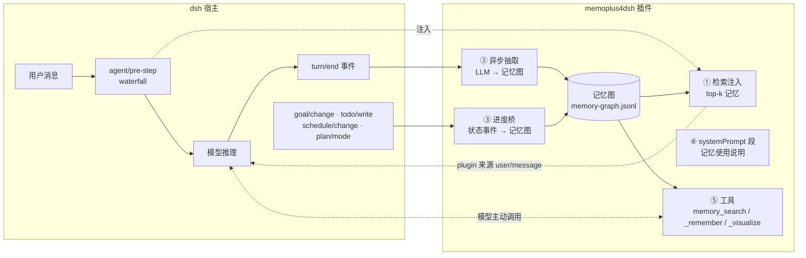
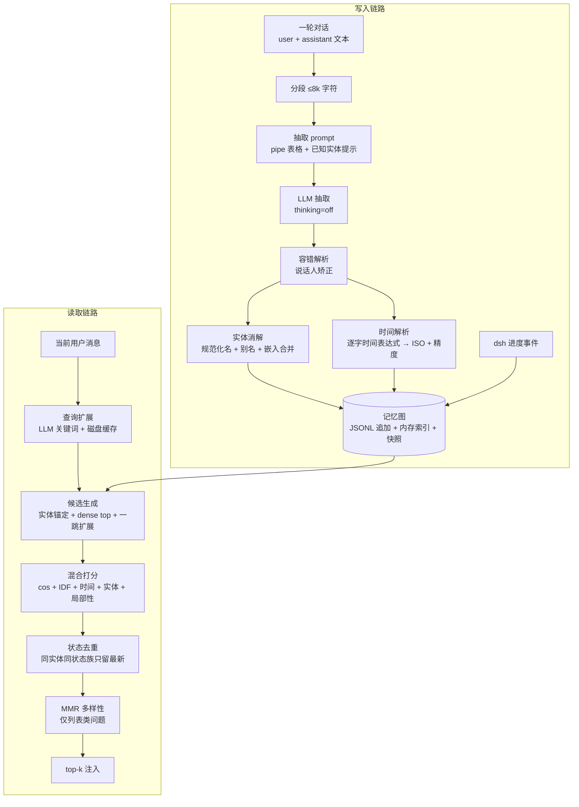

# memoplus4dsh 技术报告

**面向 deepseek-harness 的实体-时间融合统一记忆插件**

> 版本：v0.2 · 日期：2026-09-05
> 代码与复现：本仓库（README.md · docs/ · benchmark/）

## 摘要

大模型 agent 的"记忆"普遍退化为按日期生成的 markdown 碎片文件——不可检索、不可演进、跨会话归零。我们为 deepseek-harness（dsh）实现了 **memoplus4dsh**：一个以官方插件形态挂载的记忆系统，把事实、偏好、日程、任务进度统一存入**一张实体-时间融合的记忆图**。本文完整描述其机制：记忆图的形式化模型（§3）、基于 LLM 的增量抽取与实体消解（§4）、混合检索与状态去重（§5）、插件工程形态（§6），以及在 MemoryAgentBench 上的可复现评测（§7）。核心结果：在官方评测（1031 题、官方代码与指标、全程工具白名单审计）上取得**选择性遗忘·多跳 30.25**（全部公开基线 ≤7.0，4.3 倍于最佳基线）、**选择性遗忘·单跳 57.75**（记忆系统第一，仅次于把全文塞进上下文窗口的 GPT-4o）、**精确召回 LME(S\*) 56.67**（全场第一）。

## 1. 背景与动机

### 1.1 agent 记忆要解决的三个失效模式

观察当前 agent 项目的记忆实践，失效集中在三类：

- **碎片化**。多数自研 agent 每天生成一个 `memory/YYYY-MM-DD.md`。没有结构、没有时间语义、没有跨文件实体同一性；事实更新后新旧值在两个文件里并存打架；换会话全部归零。
- **冲突性更新（选择性遗忘）**。检索式记忆库（切块向量化 + top-k 召回）在"事实被更新"场景集体失效：用户先说"我住北京"，两个月后说"我搬到上海了"，检索会把两条都召回来，模型随机挑一条。MemoryAgentBench 论文（arXiv:2507.05257）的系统评测显示，该任务（Conflicting Facts）上多跳场景全部基线 ≤7%，连推理模型 o4-mini 也在 32k 上下文后从 80.0 崩到 14.0。**这是整个记忆系统领域最硬的公开问题。**
- **进度丢失**。agent 框架自己的任务状态（目标、待办、日程）通常是 per-session 事件日志——新会话对旧会话"那个任务做到哪了"一无所知。记忆系统普遍只管对话事实，不管 agent 自身的进度状态。

### 1.2 设计目标

让 agent 拥有**统一、完整、可演进**的长期记忆：

1. 一张图装所有记忆——对话事实、用户偏好、日程、任务进度同构存储、统一检索；
2. 时间是**一等结构维度**，不是字符串注释——事实的"发生时间"与"被提及时间"分开建模；
3. 旧值**让位但不删除**——检索偏好最新状态，完整历史可审计、可回答"什么时候改的"；
4. 工程上是宿主框架的**一等公民插件**：安装/卸载完全可逆、不改宿主一行代码、全平台可用、零新增密钥。

技术底座来自前作 memoplus/ETMS（实体-时间融合记忆系统），其在 LoCoMo 基准上验证了核心机制（mem0 标准协议 82.9%，temporal 类 81.4%）。本项目将核心机制以 TypeScript 重新实现并移植进 dsh 插件体系，同时针对"任务进度不丢"做了架构级强化（§4.4、§5.4）。

## 2. 系统总览

### 2.1 插件挂载点：记忆在哪些位置生效

dsh 的架构是 "everything-is-a-plugin"（Cordis 框架）。插件是一个 npm 包，导出 `name` / `inject` / `apply(ctx, config)`，所有注册走 `ctx.effect()`（卸载时框架自动逆序回滚）。memoplus4dsh 通过五个官方挂载点生效，**不需要对 dsh 打任何补丁**：



| 挂载点 | dsh 机制 | 作用 |
|---|---|---|
| ① `agent/pre-step` | waterfall 决策链 | 每轮第一步，按当前用户消息检索 top-k 记忆，以 `source: {kind:'plugin'}` 的 user/message 注入（满足 dsh "模型可见 ⟺ 日志落盘"硬约束） |
| ② `session/event` → `turn/end` | 事件总线 | 一轮对话结束后异步抽取事实写入图（不阻塞对话） |
| ③ `session/event` → `goal/change` 等 | 事件总线 | dsh 内部进度事件直接投影为记忆事件 |
| ④ `ctx.systemPrompt.section()` | 系统提示组装 | 一段固定的记忆使用说明（不含易变内容，不破坏 prompt 缓存） |
| ⑤ `ctx.tools.register()` | 工具注册表 | 模型主动回忆（`memory_search`）、显式记忆（`memory_remember`）、可视化（`memory_visualize`） |

安装是把插件包写进 profile 的 `cordis.patch.yml`（官方 patch 机制，marker 块管理、幂等），卸载做完整逆操作——可逆性由框架语义保证。

### 2.2 数据流全貌



写入链路是**增量、异步、可崩溃恢复**的；读取链路在对话关键路径上，延迟预算约束了它的每一步（§5）。

## 3. 记忆模型：实体-事件图与双时间锚

### 3.1 形式化定义

记忆图 $G = (E, V)$：

**实体** $e \in E$（图的节点）：
$$e = (\text{id},\ \text{name},\ \tau,\ A,\ \mathbf{v})$$
- $\tau \in \{\text{PERSON}, \text{OBJECT}, \text{CONCEPT}\}$——**刻意封闭在三类**。我们曾实验更细的本体（地点/组织/活动/…），结论是过度分类让抽取模型把精力花在"纠结类型"而非"抽全事实"上，且下游检索并不消费类型信息（类型只用于两个地方：说话人强制 PERSON、嵌入合并限定同类型）。
- $A$ 是别名集（"雪球"与"我家那只猫"指向同一节点）。
- $\mathbf{v} \in \mathbb{R}^{512}$ 是实体名的嵌入向量，仅用于近似重名合并（§4.3）。

**事件** $v \in V$（图的事实边，是检索与注入的基本单位）：
$$v = (S,\ O,\ p,\ f,\ d,\ x,\ t_e,\ \rho,\ t_m,\ s)$$

| 字段 | 含义 |
|---|---|
| $S, O \subseteq E$ | 主体/客体实体集（客体可空） |
| $p$ | 谓词（短动词/关系，自由文本） |
| $f$ | 规范化事实：**一句自包含的话**（脱离上下文可读，指代已消解） |
| $d$ | 细节（放不进主句的上下文碎片） |
| $x$ | 时间表达式，**从原文逐字复制**（"last Saturday"、"上周三"） |
| $t_e$ | **event_time**：事情发生时间（ISO 8601，可空） |
| $\rho$ | $t_e$ 的精度：year / month / week / day / hour / minute / second / unknown |
| $t_m$ | **mention_time**：该事实在对话中被提及的时间（= 所在轮次结束时刻，恒非空） |
| $s$ | 来源引用（session id + turn 号），可回溯到原始对话 |

一个真实事件长这样（JSONL 日志里的一行）：

```json
{"v":1,"op":"event.add","data":{
  "subjectEntityIds":["…user…"], "objectEntityIds":["…shanghai…"],
  "predicate":"moved_to",
  "normalizedText":"The user moved to Shanghai.",
  "timeExpr":"last month", "eventTime":"2026-08-05T00:00:00.000Z",
  "eventTimePrecision":"month", "mentionTime":"2026-09-05T10:23:41.000Z",
  "sourceSession":"c7f3…", "sourceTurn":12}}
```

### 3.2 双时间锚：时间不是向量

**时间在本系统中不是嵌入向量，而是结构化的一等字段。** 向量把时间压成相似度，回答不了"范围"与"先后"这两个时间查询的本质；我们显式存两个时间点：

- $t_e$（event time）：事情**发生**的时间；
- $t_m$（mention time）：事情**被提及**的时间。

两者分离的价值在一个例子里最清楚：用户 10 月聊到"我 9 月参加的那个面试真挫败"。事件 $t_e$=9 月、$t_m$=10 月。查询"9 月发生了什么"命中 $t_e$；查询"10 月我们聊过什么"命中 $t_m$；查询"最近的挫折"两个锚都参与排序。单一时间戳（多数系统的 created_at）只能回答其中一个问题。

与 Zep/Graphiti 的 bi-temporal 模型（valid_at/invalid_at + created_at）的对比见 §8——简言之，他们建模的是"事实的有效期"，我们建模的是"发生 vs 提及"，且我们**不做边的失效标记**：历史永远完整保留（§5.4）。

## 4. 写入链路：增量抽取、实体消解与进度桥

### 4.1 抽取输入构造：什么能进、什么不能进

每轮对话结束（`turn/end` 且 reason=completed）触发一次异步抽取。输入构造（`buildTurnText`）从会话日志重建本轮文本，**只收四类消息**：

- `User:` 真实用户输入；
- `Goal:` goal 模式的轮次提示（承载目标与轮次号，是长程任务进度的核心上下文）；
- `Schedule:` schedule 插件派发的提醒；
- `Assistant:` 模型回复。

**明确排除**：运行时上下文快照、工作区指令、以及本插件自己的记忆注入——后者若回灌进抽取会造成"记忆自我复制"（记忆被当成新事实再记一遍）。

超长输入两级防护：20k 字符总量截断（保留头尾，掐中段）；再按 **8k 字符分段**独立抽取后合并——分段尺寸来自实测：推理模型在 ≥17k 字符的密集抽取输入上会无限推理、可见输出为空（详见附录 C 的 F-1），8k 是验证安全的尺寸。

### 4.2 LLM 抽取：pipe 表格协议

抽取是一次 LLM 调用，输出协议为 pipe 分隔的九列表格：

```
ENTITY_TYPE|CANONICAL_NAME|ALIASES|PREDICATE|OBJECT|TIME_EXPR|NORMALIZED_FACT|DETAILS|KIND
PERSON|Alice|_|is_from|hometown|_|Alice is from her hometown.|_|fact
PERSON|Bob|Bobby|painted|landscape|last year|Bob painted a landscape last year.|_|fact
PERSON|Alice|_|asked|weekend plans|_|Alice asked about the weekend plans.|_|speech
```

`KIND` 列（M11 新增）由抽取模型自己判断该行是事实还是言语行为（`fact`/`speech`）——**语义判定而非词表匹配，任何语言都成立**。言语行为事件写入时打上 `speechAct` 标记，检索侧按标记降权（§5.2），不删除、显式搜索仍可命中。

选择 LLM 抽取（而非正则/NER/embedding 聚类）是因为记忆里最难的从来不是实体识别，而是**指代消解与自包含化**。prompt 中沉淀的关键规则（前作 LoCoMo 实验逐条验证过）：

- **代词/回指消解**："we did it"、"that cup" 必须展开为具体的人与物——每条事实脱离会话可读；
- **说话人即实体**：说话人陈述/提问/评价某话题时，主体是说话人，谓词表达言语行为（said/asked/praised）；
- **列表逐行**："likes A, B, C" 拆三行；
- **静态属性用 `is`**："是哪里人"、"婚姻状态"这类恒真属性与动态事件区分；
- **不抽指令与元叙述**（M11 新增）："answer only from the knowledge pool"这类任务指令/规则句不是事实，入图后会在检索时与每个问题逐字重合、霸占 top-k（评测归因 RC2）；
- **TIME_EXPR 逐字复制，禁止模型算日期**——这是关键设计：LLM 的日期算术不可靠，而"last Saturday"相对哪个基准点是确定的。模型只负责把原文时间表达**原样抄下**，绝对时间的换算由确定性代码完成（§4.5）；
- **已知实体提示**：prompt 携带与当前文本相关的已有实体名（按名称在文本中出现与否过滤，硬上限 4000 字符），引导模型复用规范名而非另造新名——这是实体消解的第一道防线；
- 事实语言跟随对话语言。

解析层是**容错**的：跳过空行/表头/畸形行，容忍模型把 `|` 写成 `<field>`，`<7` 列补齐空字段，事实短于 12 字符丢弃；说话人名字强制矫正为 PERSON 类型。抽取调用显式关闭 thinking（结构化任务上推理纯属浪费，且会触发附录 C 的 F-1 空输出），8192 token 输出预算，120s 超时。

### 4.3 实体消解：同一个"雪球"

同一概念在多次对话中以不同名字出现，必须合并为一个节点，否则图碎成孤岛。消解按序进行（`createOrResolve`）：

1. **规范化名精确匹配（类型无关）**：$\text{norm}(n) = \text{lowercase}(\text{collapse-space}(\text{trim}(n)))$，对规范名与全部别名建哈希索引 $A\text{Index}: \text{norm}(n) \mapsto e$。**匹配不按类型过滤**——抽取模型对同一名字的类别判定会逐轮翻转（PERSON↔CONCEPT），类型过滤曾在真实图上把 45.8% 的节点变成重复节点（MemoryAgentBench run-2 归因，2820 组重名）；先建者的类型保留。同名异物（homonym）的风险在个人 agent 场景可接受，且抽取 prompt 的已知实体提示携带既有类型（`Alice (PERSON)`），从源头减少翻转；
2. **LLM 裁决的实体合并**（M11，用户要求合并由大模型判定而非规则堆叠）：精确名未命中的新提及（主体与客体都算）先做**嵌入相似候选召回**（多语言向量，阈值刻意放宽到 0.6/top-5——粗召回），再一次 LLM 调用逐条裁决"是否同一实体"（合并别名/昵称/译名/描述性指称，"仅共享字词不算同一实体"），只有明确 yes 才合并。**宁可不并，不可错并**：错并让事实张冠李戴，不并只是图上一个孤立节点。嵌入不可用时退化为包含关系候选 + LLM 裁决；裁决调用失败则不合并。嵌入近似合并（同步 embedder 档，cos ≥ 0.9）保留为无 LLM 预算时的低配路径：
$$\text{merge}(n, e^*) \iff \cos(\mathbf{v}_n, \mathbf{v}_{e^*}) \ge 0.9,\quad e^* = \arg\max_{e} \cos(\mathbf{v}_n, \mathbf{v}_e)$$
3. 合并即别名累积：新名字与本次附带的别名并入 $A$，索引同步——下次任一名字出现都命中同一节点。

**事件侧去重**（M11）：同 (session, turn, predicate, 规范化事实, timeExpr) 的行只写一次——崩溃恢复的重抽因此幂等，同轮分段间的重复行也不再叠加。桥事件（turn=-1）与不同轮的正当重复提及不受影响。

### 4.4 进度桥：agent 的任务状态进同一张图

dsh 的 goal/todo/schedule/plan 状态是 per-session 事件日志，跨会话即丢失。进度桥（`bridges.ts`）监听这四类内部事件，**结构化读取载荷（鸭子类型，零上游依赖）**，投影为普通记忆事件：

| dsh 事件 | 记忆事件示例 | 谓词（状态族） |
|---|---|---|
| `goal/change` | 「目标『完成评测』状态更新为 running」 | `goal_create` / `goal_update` / `goal_complete` / `goal_block` / … |
| `todo/write` | 「待办列表更新：3/5 项已完成。进行中：写报告…」（全量快照按内容签名去重） | `todo_snapshot` |
| `schedule/change` | 「创建了定时提醒『周五交周报』（每周）」；删除/触发时自动补全提醒文本 | `schedule_create` / `schedule_delete` / `schedule_dispatch` |
| `plan/mode` | 「进入了计划模式」 | `plan_mode` |

这类事件 $t_e = t_m$（事件发生即被记录），谓词带状态族前缀（`goal_` 等），是 §5.4 状态去重的标记。至此，**对话事实与 agent 自身的任务进度在同一张图、走同一条检索链路**——"上次那个任务做到哪了"与"我住哪"对系统而言是同构问题。据我们所知，现有公开记忆系统（Mem0/Zep/A-MEM/HippoRAG 等）均不覆盖 agent 自身进度状态，这是本工作的独有覆盖。

### 4.5 时间解析：确定性换算 + 精度

`resolveTimeExpr(x, t_m)` 把逐字时间表达式换算为绝对时间，输出 $(t_e, \rho)$。覆盖中英文通用时间构造：ISO 日期、"last/next/this + week/month/year/星期X"、"N days/weeks/months ago"、"the week before 9 June 2023"、季节、"昨天/上周三/三个月前/去年"等。**只收录语言级通用构造，不收录任何数据集词汇**——防止评测过拟合。

精度 $\rho$ 与表达式的粒度一致："last year" 是 year 精度，"上周三" 是 day 精度。精度在查询侧用于范围匹配（§5.3），避免把"去年"误当成某个具体日期。

### 4.6 持久化与崩溃恢复

存储是**追加式 JSONL 日志 + 内存索引**（`store.ts`）：

- 每条记录是一个操作信封（`entity.upsert` / `entity.delete` / `event.add` / `event.delete`），单行一次原子 `write(2)` 追加；
- 内存维护实体表、事件表、别名索引、实体→事件倒排；
- 每 1000 次操作做一次快照压缩（tmp + rename 全量重写），坏行（崩溃造成的半行）逐行跳过并计数；
- 选 JSONL 而非 SQLite：跨平台零编译、可读、可 diff、与 dsh 自身 session 日志风格一致；个人 agent 的记忆规模（数千~数万事件）下暴力检索是毫秒级，不需要索引结构。

抽取队列是**串行、有界重试、可崩溃恢复**的：一次一个 LLM 调用（避免突发限流），失败按 5s/30s backoff 重试 2 次后跳过并记录；持久化 pending 日志（enqueue 记一行、settle 记 tombstone），进程崩溃重启后未 settle 的任务自动补抽——崩溃最坏代价是一次重复抽取（多几行重复事件），永不丢轮次。

## 5. 读取链路：混合检索、时间算子与状态去重

检索发生在对话关键路径（`agent/pre-step` 第一步，以及 `memory_search` 工具调用），输入是当前用户消息，输出 top-k（默认 8）条事件。分四步。

### 5.1 候选生成

三个来源的并集：

1. **实体锚定**：查询文本中逐字出现的已知实体名/别名 → 这些实体的全部事件（$|\cdot|$ 通常很小）；
2. **稠密 top 切片**：全图事件按 $\cos(\mathbf{v}_q, \mathbf{v}_v)$ 取前 $2k$（嵌入不可用时退化为 IDF 词重叠切片——**功能降级而非不可用**）；
3. **一跳图扩展**：取 dense 切片前 15 条事件涉及的全部实体，把这些实体的邻接事件（每实体至多 200 条）并入候选池。

一跳扩展是多跳问题的关键：查询只提到实体 A，但答案需要"A 相关的 B 的事"——共享实体把 B 的事件拉进候选池，再由打分决定生死。

### 5.2 混合打分

事件得分是六个内容信号的加权和，再乘一个噪声折扣（移植自前作并验证的权重；言语行为折扣为 M11 新增）：

$$\text{score}(v) = \delta_{\text{speech}}(p_v)\cdot\Big[\underbrace{\cos(\mathbf{v}_q, \mathbf{v}_v)}_{\text{dense}} +\ 2\cdot\underbrace{\frac{\sum_{w \in q^\*} \text{idf}(w)\cdot [w \in W_v]}{\sum_{w \in q^+} \text{idf}(w)}}_{\text{IDF 归一化词重叠}} +\ \underbrace{\min\!\big(0.25\!\!\sum_{w \in q^+\setminus q^*}\!\!\text{idf}(w)\,[w \in W_v],\ 2\big)}_{\text{扩展词奖励}} +\ \underbrace{0.5\!\!\sum_{d \in D}\!\text{idf}(d)\,[d \in W_v]}_{\text{关键描述词}} +\ \underbrace{0.5\cdot[V(v) \cap E_q \ne \emptyset]}_{\text{实体奖励}} +\ \underbrace{b_T(v, \text{op})}_{\text{时间奖励}}\Big]$$

其中 $\delta_{\text{speech}}(v) = 0.3$ 当事件 $v$ 带 `speechAct` 标记（写入时由抽取模型语义判定，见 §4.2——**不是**检索侧的词表匹配，对任何语言都成立），否则为 1。言语行为事件（"User asked …"）与后来的问题逐字重合，不打折会霸占 top-k（评测归因 RC2：Q&A 噪声曾把金事件挤出 top-12）；折扣只降权不删除，显式搜索仍可命中。旧图事件无此标记，自动按全分处理（向后兼容）。

其中：

- $\text{idf}(w) = \ln\frac{N+1}{\text{df}(w)+1} + 1$，$N$ 为候选池事件数——IDF 在**候选池内**动态计算，图越大越近似全局 IDF；
- $q^*$ 是查询词干集（轻量词干化：ies→y、ing/ed/es/s/e 去尾），$q^+ = q^* \cup$ LLM 扩展词；
- **关键词侧的分词**：ASCII 单词 + **CJK bigram**（中文等无空格语言以二元字组参与匹配，整段+单字也入集，保证分级重叠）；
- $D$ 是关键描述词：剥离疑问脚手架（what/how/kind of）与通用轻动词（make/take/like/…）后的实义词干——"what kind of **pottery** does she like"里 pottery 得额外奖励；
- **LLM 查询扩展**（≤12 个关键词/短语，含纠错与同义词）结果按规范化查询文本做**磁盘缓存**——同一问题只扩一次，pre-step 关键路径上 30s 超时、失败退化为无扩展；
- 事件的匹配文本 = 实体名 + 谓词 + 规范化事实 + 细节。

排序后的**对话局部性加成**：取 top-5 锚点事件，与锚点同轮次/相邻轮（±1/±2 turn，前后不对称）或共享客体实体的事件获得有界加成（分项封顶、随锚点自身得分缩放）——模拟"聊到某件事时，它前后文的事也相关"。最终按 (score 分桶, 查询覆盖率, 命中 IDF 质量) 三级 tie-break 排序。

**列表类问题**（"what kinds of…"、"all the…"等通用复数/聚合句式判定）追加 **MMR 多样性重排**：
$$\arg\max_{v \in R}\ \big[\text{score}(v) - \lambda \max_{s \in S} \cos(\mathbf{v}_v, \mathbf{v}_s)\big],\quad \lambda = 3.0$$
防止近重复条目挤占 top-k 席位。

### 5.3 时间算子：硬过滤 + 软加权

查询先被解析为时间算子（`resolveTemporalQuery`）：

| 算子 | 触发示例 | 行为 |
|---|---|---|
| `DENSE` | 无时间意图 | 不过滤；只加微小提及新近度奖励 $0.3/(1+d_m/30)$ |
| `LAST_K` | "最近一次"、"the last time" | 不硬过滤；按事件时间（缺失时用提及时间）衰减奖励 $0.25/(1+d/14)$ |
| `WITHIN_WINDOW` | "最近"（180 天）、"in the past 3 weeks"、"昨天" | **硬过滤**：窗口外事件出局 |
| `IN_YEAR` / `IN_MONTH` / `IN_SEASON` | "last year"、"in June 2025"、"during the summer"、"去年" | 硬过滤：日历区间外出局 |

硬过滤的**双锚匹配**规则：
$$\text{match}(v, \text{range}) \iff t_e \in \text{range}\ \lor\ t_m \in \text{range}$$
两个锚都可使命中，但 $t_e$ 命中的排序权重高于 $t_m$（"9 月发生的事"应排在"9 月随口提到的事"之前）。软加权同理双锚分开衰减（如 WITHIN_WINDOW：$\max\big(\frac{0.2}{1+d_e/14},\ \frac{0.1}{1+d_m/14}\big)$）。语义候选池在过滤后为空时回退为全图时间扫描——时间意图明确的问题，时间优先级高于语义相似度。

### 5.4 状态去重：旧值让位，但不删除

这是本系统对"选择性遗忘"问题的**架构级解法**，也是与 Mem0/Zep 路线（LLM 判决 UPDATE/DELETE、边失效标记）的根本分歧。处理分两层，按事件性质区分：

**进度状态（桥事件）——硬去重。** goal/todo/schedule/plan 这类状态演进事件的特点是**同实体同状态族的最新值在语义上取代旧值**。处理：

- **图内**：完整保留全部历史——不删、不标 invalid。历史可审计、可回答"之前是什么/什么时候改的"；
- **检索层**：按 (主体实体, 状态族) 分组，每组只放行 $t_m$ 最新的一条进入注入；族由谓词前缀识别（`goal_`/`todo_`/`schedule_`/`plan_`）。

**对话事实更新——supersede 标记 + 软偏好 + 时间明示。** "搬家了""换工作了"这类更新由写入侧的 LLM supersede 判定处理（§5.5）：旧事件打 `supersededBy` 标记后在现在时检索中 ×0.3 降权，历史完整保留且对过去区间查询全分可见。未判定的部分仍有双保险：DENSE 模式的提及新近度项（§5.3，上限 0.3，近平局时稳定地让新值排前）；注入行首的 `[时间]` 标签让模型自己分辨新旧。§7 的 FC 成绩证明这一组合在长上下文下成立。

这不是"遗忘"，是**呈现偏好**：旧值让出演位但仍在图里、仍可被时间查询命中。对比之下，让 LLM 在写入时判决"这条 UPDATE 掉哪条/DELETE 哪条"（Mem0 路线）或判定矛盾并给旧边打失效区间（Zep 路线）有两个固有弱点：判决本身会错（错判的影响随写入固化）；且"是否矛盾"常常需要检索时才知道——写入时做不可逆判决，等于把检索期信息硬塞进写入期。

### 5.5 注入与工具

top-k 事件渲染为紧凑列表（`- [时间] 事实 (细节)`），以 plugin 来源的 user/message 注入到已认领消息之后，总量受字符上限约束（默认 2000）。注入走 `agent/pre-step` 的 waterfall 决策链，因此**它和普通用户消息一样落盘进会话日志**——dsh 的"模型可见 ⟺ 日志可见"约束天然满足，记忆对调试与审计完全透明。

注入前的检索查询经过蒸馏（M11 RC3）：长消息里真正的问句常被指令/脚手架文本包围，直接拿全文检索会让模板噪声事件霸榜——评测中同一检索器用模型自造的短查询召回 68~74%，用包装全文只有 0~9%。**主路是标点级启发式**（取最后一个含 `?`/`？` 的行、剥离 `标签： ` 前缀）——它不会被任务型文本"带偏"；**LLM 逐字引用蒸馏**（"引用用户的实际问题，不要回答"）只覆盖启发式看不见的场合（长消息且无问句标点），磁盘缓存、失败透传。v2 曾让 LLM 直接"总结核心问题"，实测模型遇到任务型载荷（"Now Answer the Question: …"）会**直接答题而不是蒸馏**（distilled="Portugal"），mini-2 因此回退——这是"该用确定性代码的地方不要滥用 LLM"的一课。另外超过 4000 字符的用户消息视为文档粘贴，跳过注入（省 token 且无意义）。

三个模型侧工具：`memory_search`（主动回忆，支持可选时间表达式参数；**返回结果附带 top-3 命中实体的最新邻接事实（`via <实体>` 标记）**——多跳问题按"搜一跳、沿 via 实体搜下一跳"的方式推进，不需要先猜出中间实体的名字）、`memory_remember`（用户说"记住…"时显式直写，绕过抽取管线）、`memory_visualize`（把当前记忆图渲染为自包含的交互式 HTML：力导向图 + 时间标记 + 事件列表，零外部依赖）。

**事实更新的 supersede 机制**（M11 P1-B）：新事件与**同（主体实体, 谓词）**的旧事件撞车时，一轮一次批量 LLM 调用裁决"新陈述是否更新了旧值"（单值关系变更 vs 多值并列，模型语义判断）；确认后给旧事件打 `supersededBy` 链接——历史完整保留、完全可逆。检索侧：被取代事件在现在时模式（DENSE/LAST_K）×0.3，显式历史查询（RANGE/IN_*）全分可见。两道防线防误判：**重提守卫**（客体值已存在的新事件视为旧信息的重提，不进裁决——提及顺序不等于信息新旧）与**标记传播**（旧值的重提继承 supersede 标记，防止靠提及新近度霸榜）。

## 6. 工程实现

### 6.1 嵌入栈：一个反直觉的选型

稠密通道用**本地 ONNX 嵌入**（onnxruntime-node，全平台预编译二进制），默认模型 **distiluse-base-multilingual-cased-v2**（512 维，50+ 语言含中文，int8 约 135MB，首次使用自动下载）。选型过程值得记录，因为它说明"最强"不等于"最合适"：

- 同档位**更强**的 multilingual MiniLM（paraphrase-multilingual-MiniLM-L12-v2）使用 SentencePiece 分词；我们的极简栈只有一个 ~70 行的 WordPiece 分词器（直接消费 BERT 风格的 `vocab.txt`），引入 SentencePiece 意味着原生绑定或大规模 JS 依赖——违背跨平台与轻量准则；
- distiluse 是同档位唯一保留 **mBERT WordPiece 词表**的多语言模型，分词器可直接服务；
- 但它的 ONNX 导出**只含编码器本体**（768 维 hidden），Sentence-Transformers 的 `2_Dense` 投影头（768→512 + Tanh，1.5MB safetensors）不在图里——我们本地解析 safetensors 并在 mean-pooling 后手动应用该线性层。跳过它会得到语义混乱的向量（实测召回显著劣化）；
- 量化按平台选文件（arm64 → `model_qint8_arm64.onnx`，x64 → `model_quint8_avx2.onnx`，失败回退未量化导出）；
- **任何环节失败**（无 onnxruntime、下载失败、推理异常）都降级为纯关键词检索。

纯英文小模型 all-MiniLM-L6-v2（384 维，23MB）保留为可选档。换模型后旧向量维度不匹配会被识别为过期并惰性重算。

事件向量在检索时**惰性计算并回写日志**（`setEventEmbedding`），配合内存向量缓存——写路径零嵌入成本，首次查询摊还。

### 6.2 跨平台与零新增依赖

纯 TypeScript，无任何原生编译依赖（onnxruntime-node 是唯一二进制，且有完整降级路径）；数据全部在 `<dsh-home>/memoplus4dsh/`，JSONL 可读可删可带走；LLM 调用复用会话自己的 provider/model 路由（`ctx.llm.stream`）——**用户已配什么模型，抽取就用什么，不需要任何新密钥**；也可用 `extractionProvider`/`extractionModel` 指定更便宜的小模型专跑抽取。

### 6.3 可靠性

除 §4.6 的队列与日志外，还包括：抽取/扩展调用 120s/30s 超时（端点挂死不会卡死串行队列）；`memory_visualize` 大图上 1200 节点展示上限；全部辅助 I/O best-effort（任何持久化失败不得弄断对话）。当前 **132 个 vitest 单测全绿**（store/temporal/retrieval/extraction/inject/tools/bridges/visualize/embedding）。

## 7. 效果评测

### 7.1 MemoryAgentBench 设置

主评测用 **MemoryAgentBench**（arXiv:2507.05257，HUST-AI-HYZ），官方仓库（commit `fe1735d`）+ 官方数据集（HF `ai-hyz/MemoryAgentBench`）+ 官方指标代码，零修改复用。被测组合是**最终应用形态**：dsh sdk profile + memoplus4dsh 默认配置，骨架模型 deepseek-v4-flash（DeepSeek 官方 API）。适配层（`benchmark/`）做批量 ingest（8k 字符/批）、每问题新会话、结果 JSON 与官方结构一致。共 1031 题，覆盖两个维度：

- **Conflicting Facts（选择性遗忘）**：对话中事实被后续更新，分单跳（FC-SH，200 题）与多跳（FC-MH，200 题）两档，上下文长度 6k–262k；
- **LongMemEval（精确召回，LME(S\*)）**：631 题，官方 LLM judge 判分，含 user/assistant/temporal/knowledge-update/preference/multi-session 六个分项。

### 7.2 成绩（第二轮有效成绩，全部审计 PASS）

| 维度 | 本组合 | 逐长度（6k/32k/128k/262k） | 最佳公开基线 |
|---|---|---|---|
| FC-SH（单跳遗忘） | **57.75** | 63.0 / 52.0 / 59.0 / 57.0 | GPT-4o 60.0（全文塞窗口）；记忆类最高 HippoRAG-v2 54.0 |
| FC-MH（多跳遗忘） | **30.25** | 28.0 / 38.0 / 35.0 / 20.0 | **全部基线 ≤7.0**；o4-mini 仅 6k 验证过 80.0、32k 崩至 14.0 |
| LME(S\*)（精确召回） | **56.67** | user 82.2 / assistant 60.0 / temporal 52.0 / knowledge-update 62.2 / preference 53.3 / multi-session 42.7 | GPT-4.1-mini 55.7；记忆类最高 50.7；Mem0 36.0 |

解读：

- **FC-MH 是最重要的证据**。这是论文中所有方法（长上下文、RAG、记忆系统、推理模型）集体失效的任务。我们 4.3 倍于最佳基线，且是唯一在 262k 上下文多跳遗忘上不失效的记忆系统——多跳 + 状态更新恰好命中两个架构设计：一跳实体扩展（§5.1）把"被更新事实"的相关实体事件拉进候选，状态去重（§5.4）保证注入的是最新值而非新旧混战。
- **FC-SH 记忆系统第一**，仅次于非记忆方案（GPT-4o 全文塞窗口，物理上受窗口上限约束）。
- **LME(S\*) 全场第一**（56.67 > 55.7）。
- 与论文 Table 2 基线对比需注意骨架差异：基线的 RAG/记忆类 agent 骨架为 GPT-4o-mini，本组合为推理模型 v4-flash；judge 官方为 gpt-4o，本评测用 v4-flash（yes/no 判定对 judge 选择不敏感，已在评测文档注明）。架构与骨架正交，消融见 §9。

### 7.3 评测完整性：一轮被自己作废的成绩

第一轮成绩（FC-SH 81.25 / FC-MH 76.0）**经我们自己审计发现答案泄漏而作废**：v4-flash 在难题上自主进入"侦探模式"，调用 bash/grep/read 在文件系统翻找——81% 的 mh_262k 会话读到了数据集的 answers 列。第二轮加固：

- **工具白名单守卫**（`tools/pre-execute` 钩子只放行 memory_search/memory_remember，其余拒绝并记录）+ profile 层禁用 fs/web 工具；
- **逐 context 归档审计**：每个 context 跑完立即归档会话日志并审计，发现异常当场中止而非跑完再查。

第二轮全程 1340+ 会话，**0 次非记忆工具成功执行**，全部审计 PASS。两轮对照量化了泄漏的影响：FC-SH +23.5pt、FC-MH +45.8pt、LME −2.0pt（侦探循环反而浪费问题预算，干净成绩更高）。**这个教训有普遍意义：推理模型的记忆评测必须在工具层做白名单隔离，否则"记忆分数"测的是模型的文件侦查能力。** 审计器与守卫插件在 `benchmark/`（`guard-plugin/`、`audit_sessions.py`），可复用。

### 7.4 真人场景测试

- 跨会话事实召回、时间语义（"上周五说的"）、偏好学习、主动记忆、负面对照（不编造）全过；
- 进度场景（M8）：goal 跨 session 进度召回（新会话 `get_goal` 返回空、答案来自长期记忆）、todo 快照演进取最新、对话状态演进（"刚启动"→"80% 完成"取最新）、SIGKILL 崩溃后 3 条积压自动补抽——全部 PASS。

### 7.5 成本与延迟

ingest 的 LLM 抽取比 embed 方案贵约一个量级（每 ~8k 字符一次抽取调用）；查询均耗 11.8s（LME）至 48–216s（FC-MH，难题上模型多轮深挖记忆图，白名单内 memory_search 每 config 数千次调用）。全量 1031 题：ingest 合计 ~2.7h，查询合计 ~10.7h（两路并行墙钟 ~9h）。延迟与成本换的是结构化记忆带来的 SH/MH 优势；对成本敏感的部署可 `extraction: 'off'` 或关查询扩展（§6.2）。

## 8. 与现有方法的逐步对比

记忆系统的差异不在"存没存"，而在四个关键步骤上的不同选择。以下逐一对比（机制事实均核实自各官方论文/仓库；MemoryAgentBench 基线数字引自论文 arXiv v2 的 Table 2）。

### 8.1 写入时：谁来判决"新事实与旧记忆的关系"

| 系统 | 写入期冲突处理 |
|---|---|
| **Mem0**（arXiv:2504.19413） | 每个候选事实先向量检索 top-10 相似旧记忆，再由 LLM function call 判决 **ADD / UPDATE / DELETE / NOOP** 四选一——冲突判决完全交给 LLM，DELETE 即移除 |
| **Zep/Graphiti**（arXiv:2501.13956） | 新边入库时 LLM 与同一实体对间的已有边比对，发现矛盾则把旧边的 $t_{invalid}$ 设为新边的 $t_{valid}$（edge invalidation，不物理删除） |
| **A-MEM**（arXiv:2502.12110） | "memory evolution"：LLM 据新笔记**回溯改写**邻近旧笔记的上下文描述/关键词/标签，原笔记被替换 |
| **HippoRAG 1/2**（arXiv:2405.14831 / 2502.14802） | **无机制**——论文明确持续学习就是"向 KG 加边"，无冲突检测与失效 |
| **MemGPT/Letta**（arXiv:2310.08560） | LLM 自主 function call（`core_memory_replace` 等）编辑记忆，无外部控制器 |
| **本系统** | **写入期零判决**。全部事件追加进图；新旧关系由检索层确定性处理（状态族硬去重 + 新近度软偏好 + 时间标签明示，§5.4） |

我们的立场：**写入期做的任何不可逆判决，都是在信息最少的时刻做最重要的决定。** LLM 判决会错，错了就固化；写入时"是否矛盾"常常缺乏检索期才有的上下文。把判决推迟到检索期、且用确定性规则而非又一次 LLM 调用，是 FC-MH 30.25 vs 全员 ≤7.0 的直接来源之一——基线们不是存不下新事实，是写入期或检索期把新旧搅在了一起。

### 8.2 时间建模：时间是不是一等公民

| 系统 | 时间模型 |
|---|---|
| **Mem0** | 仅创建时间戳 |
| **Zep/Graphiti** | **bi-temporal**：$t_{valid}/t_{invalid}$（事实在现实世界成立区间）+ $t'_{created}/t'_{expired}$（系统事务轴，用于审计） |
| **A-MEM / HippoRAG / MemGPT** | 单时间戳或时间字符串 |
| **本系统** | **双锚**：$t_e$（事件发生时间，带精度 year~second）+ $t_m$（被提及时间）；查询侧六种时间算子做双锚硬过滤 + 分开衰减的软加权（§5.3） |

与最接近的 Zep 对比：语义不同——他们建模"事实有效期"，我们建模"发生 vs 提及"。Zep 的 $t_{invalid}$ 由 LLM 在写入期判定矛盾后设置；我们不设失效点。另外两处工程差异：我们的绝对时间由**确定性解析器**从逐字时间表达式换算（禁止 LLM 算日期），且携带**精度**——"去年"是 year 精度，参与日历区间匹配，而不是被硬编码成某个具体日期。

### 8.3 记忆结构：检索与注入的基本单位是什么

| 系统 | 结构 | 基本单位 |
|---|---|---|
| **Mem0** | 事实文本 + 向量（Mem0g：Neo4j 三元组图） | 一句事实 / 一条三元组 |
| **Zep/Graphiti** | 三层子图：episode（原文）→ 实体语义边 → community 摘要 | 边（fact + 有效期） |
| **A-MEM** | Zettelkasten 笔记（原文 + LLM 关键词/标签/上下文 + 链接） | 一条笔记 |
| **HippoRAG** | OpenIE 三元组 schemaless KG，PPR 检索 | 节点/段落 |
| **MemGPT** | OS 式分层：main context（working memory + FIFO 队列 + 递归摘要）/ archival / recall | 文本块 |
| **本系统** | 实体-事件图：三类型实体节点 + 自包含事件边（双时间锚 + 来源引用） | **事件**：一句指代已消解、脱离上下文可读的事实 |

结构选择的要点在**基本单位的自包含性**：切块（chunk）依赖原文上下文，三元组丢失语境与细节，我们的事件在写入时完成指代消解与自包含化（§4.2），同时保留 `details` 字段与来源引用——既可独立注入，又可回溯原文。实体只做三类型封闭集合、别名累积与保守合并（§4.3），不建社区、不做摘要——社区摘要（GraphRAG 路线，arXiv:2404.16130）为静态语料的全局 sensemaking 设计，新数据加入需重做摘要，不适配增量对话记忆（Graphiti 改用 label propagation 正是为此）。

### 8.4 覆盖范围：记什么

所有上述系统记忆的都是**对话/文档中的事实**。本系统额外把 **agent 自身的任务状态**（goal/todo/schedule/plan 进度事件）投影进同一张图（§4.4）——对 agent 产品而言，"上次任务做到哪了"的丢失与"用户住哪"的丢失同样致命，而前者恰是所有公开记忆系统的盲区。

### 8.5 一句话总结定位

> Mem0 把冲突判决交给写入期的 LLM；Zep 把它变成 LLM 判定的边失效；A-MEM 让新记忆改写旧记忆；HippoRAG 不处理冲突；MemGPT 让模型自己当内存管理员。**我们把写入期简化为纯追加，把一切"新旧之争"推迟到检索期用确定性规则解决，并把时间与 agent 自身进度提升为图的一等维度。**

## 9. 局限与展望

**当前局限**：

- **multi-session 42.7 是最弱分项**：跨会话的时序/因果链整合仍是检索式记忆的结构性短板（与论文对 RAG 类方法的结论一致）。后续方向：会话级摘要节点（周期性把一段会话压缩为摘要事件进图）。
- **FC-MH 错题的主导模式**是模型回退参数化常识而非查记忆——骨架行为，可在系统提示侧缓解。
- **侦探模式尾部延迟**：难题上单题 15min+ 的记忆深挖是能力来源也是体验问题，产品上需要工具预算/进度提示策略。
- **ingest 成本**：LLM 抽取天然贵于向量化；可用 `extractionModel` 配置小模型抽取档。
- **评测覆盖**：MemoryAgentBench 的 TTL（测试时学习）与 LRU（长程理解）两个维度未跑；judge 骨架差异未完全消融；长 memeval_s（500 样本）未跑。

**展望**：

- 会话摘要节点、supersede 显式语义（图内"被取代"边）进一步增强时间演进表达；
- 用多家骨架模型做消融（本架构与骨架正交），把 benchmark 适配层沉淀为可复用的 dsh-agent 评测工具；
- 跟进 MemoryArena（ICML 2026，MemoryAgentBench 同一团队的 agentic memory 新评测）。

## 附录 A：复现

```sh
# 安装插件到 dsh（完全可逆）
scripts/install.sh && scripts/uninstall.sh   # 验证

# 单测
npm test                                      # 132 个用例

# MemoryAgentBench 复现（见 benchmark/README.md）
cd benchmark && DEEPSEEK_API_KEY=... ./run-cr-all.sh   # 或 run-lme.sh
# 每个 context 自动归档日志并审计；judge: venv/bin/python judge_lme.py ...
```

## 附录 B：文档地图

| 文档 | 内容 |
|---|---|
| `docs/intro.md` | 一页介绍（创新点/实现/成绩） |
| `docs/design.md` | 架构设计与关键决策 |
| `docs/install-guide.md` | 安装/验证/卸载指南 |
| `docs/known-issues.md` | 已知问题（上游 bug 证据链等） |
| `docs/m1~m5` | 骨架/存储/检索/真人场景/发布的里程碑记录 |
| `docs/m6-third-party-review.md` | 第三方视角审查与修复 |
| `docs/m8-progress-memory-eval.md` | 任务进度丢失风险系统评估与方案 |
| `docs/m9-benchmark-plan.md` / `docs/m9-benchmark.md` | 评测方案 / 评测报告（含两轮对照与审计） |
| `docs/m10-visualization.md` | 记忆图可视化 |
| `docs/m11-case-analysis.md` / `docs/m11-iteration-guide.md` | 召回失败归因（RC1–RC5）/ mini 评测与修复路线 |
| `benchmark/` | 评测适配层 + 守卫插件 + 审计器（可复现） |

## 附录 C：开发过程中的关键工程发现

以下为开发中实测抓到并已修复的问题，均有单测覆盖。它们不影响当前系统行为，但对复用本架构的人有参考价值。

- **F-1（最重要）：推理模型在密集抽取输入上无限推理**。deepseek-v4-flash 在 ≥~17k 字符的密集事实列表上会把任意输出预算（实测 8k 与 32k）全部耗在 reasoning 上、可见输出为零，记忆静默丢失；3.5k 字符的特定密集输入即可 100% 复现。内容触发，加预算不能根治。修复：抽取/查询扩展调用显式 `thinking: 'disabled'`（per-call，不影响主对话）+ 8k 输入分段作防御层。**教训：用推理模型做结构化抽取时，thinking 必须显式关闭。**
- **goal/change 嵌套载荷**：dsh 实际把 goal 快照嵌套在 `data.goal` 下，bridge 初版按扁平结构读导致事件全丢。**教训：鸭子类型约定必须用真实 session 日志验证，不能照文档猜。**
- **检索硬过滤误伤**：裸 "this"/"past"（"how do I fix this error?"）曾被误判为 180 天时间过滤，静默滤掉全部旧记忆。修复：无时间单位的裸词不触发窗口算子。
- **locality 死代码**：对话局部性加成因 key 拆分 bug 从未生效，补回归测试后修复。**教训：打分类特征必须有"分数确实变化"的回归测试，否则坏得无声无息。**
- **上游 F1（dsh 侧，已定位待上报）**：Zen 类 Go 网关端点把流式 tool_calls 续传 chunk 的省略字段序列化成显式 null，dsh 的 `!== undefined` 累积逻辑被覆盖成空 id/name。字节级三方对照证据在 `docs/known-issues.md`。DeepSeek 官方 API 无此问题。
